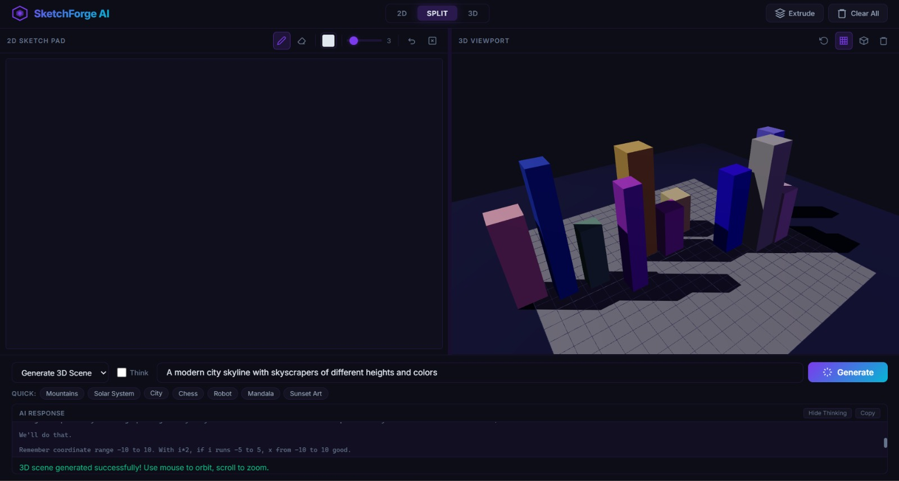
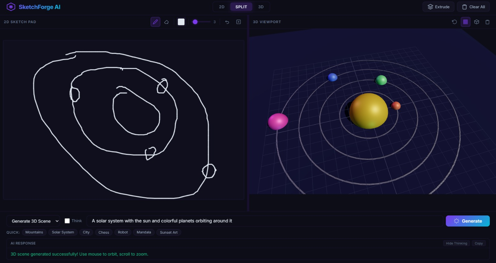
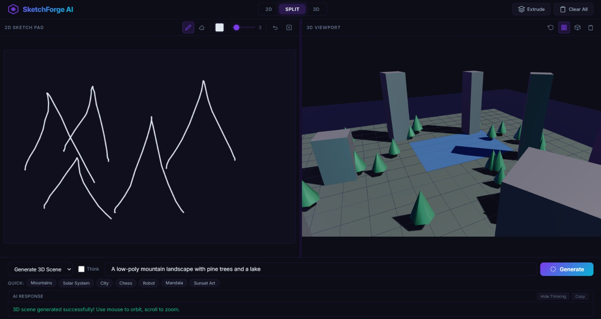
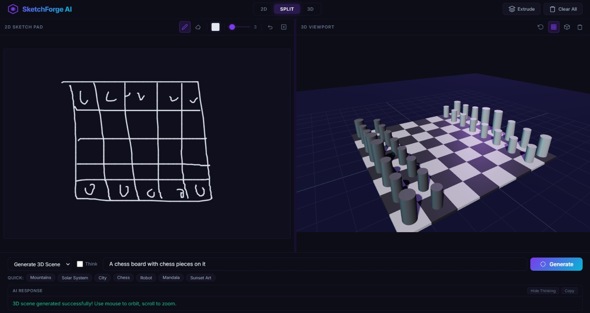
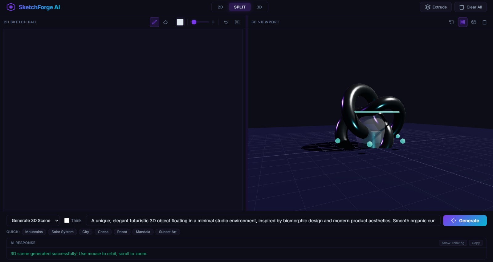

# 🎨 SketchForge AI

> Transform your 2D sketches into stunning 3D scenes with the power of AI

<div align="center">


</div>

---

## ✨ About

**SketchForge AI** is an innovative web application that bridges the gap between 2D sketches and 3D visualization. Draw anything on the canvas, describe your vision, and watch as AI generates immersive 3D scenes in real-time. Powered by NVIDIA's AI models and Three.js rendering engine, SketchForge makes 3D design accessible to everyone.

## 🎬 Showcase

<table>
  <tr>
    <td align="center" width="50%">
      
      <br />
      <em>Modern city skyline with skyscrapers</em>
    </td>
    <td align="center" width="50%">
      
      <br />
      <em>Solar system with orbiting planets</em>
    </td>
  </tr>
  <tr>
    <td align="center" width="50%">
      
      <br />
      <em>Low-poly mountain landscape with trees</em>
    </td>
    <td align="center" width="50%">
      
      <br />
      <em>3D chess board with pieces</em>
    </td>
  </tr>
  <tr>
    <td align="center" width="100%">
        
      <br />
      <em>3D - Quantum Bloom</em>
    </td>
  </tr>
</table>

## 🚀 Features

- **✏️ Intuitive 2D Drawing Canvas** - Draw freehand sketches with customizable brush sizes and colors
- **🤖 AI-Powered 3D Generation** - Describe your vision and let AI create complex 3D scenes
- **👁️ Real-time 3D Rendering** - Interactive Three.js viewport with orbit controls and smooth animations
- **🎨 Split View Mode** - Work with 2D and 3D simultaneously for instant feedback
- **🔄 Multiple View Modes** - Switch between 2D-only, 3D-only, or split view layouts
- **🎯 Quick Scene Templates** - One-click generation for mountains, cities, solar systems, and more
- **💾 Drawing History** - Undo/redo functionality with full stroke history
- **🎪 Interactive Controls** - Zoom, pan, and orbit to explore your 3D creations
- **⚡ Hardware-Accelerated** - Leverages WebGL for smooth 60fps rendering

## 🛠️ Tech Stack

### Frontend

- **Three.js** - 3D graphics rendering
- **Vanilla JavaScript** - Core application logic
- **HTML5 Canvas** - 2D drawing interface
- **CSS3** - Modern, responsive UI design

### Backend

- **Node.js** - JavaScript runtime
- **Express.js** - Web application framework
- **NVIDIA AI API** - AI-powered code generation
- **dotenv** - Environment configuration
- **CORS** - Cross-origin resource sharing

## 📋 Prerequisites

Before you begin, ensure you have the following installed:

- **Node.js** (v18.0.0 or higher) - [Download](https://nodejs.org/)
- **npm** (comes with Node.js) or **yarn**
- **NVIDIA API Key** - [Get yours here](https://build.nvidia.com/)
- A modern web browser (Chrome, Firefox, Edge, or Safari)

## 📦 Installation

### 1. Clone the Repository

```bash
git clone https://github.com/yourusername/sketchforge-ai.git
cd sketchforge-ai
```

### 2. Install Dependencies

Using npm:

```bash
npm install
```

Or using yarn:

```bash
yarn install
```

### 3. Configure Environment Variables

Create a `.env` file in the root directory:

```bash
touch .env
```

Add your NVIDIA API key to the `.env` file:

```env
NVAPI_KEY=your_nvidia_api_key_here
```

> **How to get your NVIDIA API Key:**
>
> 1. Visit [NVIDIA API Catalog](https://build.nvidia.com/)
> 2. Sign up or log in to your account
> 3. Navigate to the API section
> 4. Generate a new API key
> 5. Copy and paste it into your `.env` file

## 🚀 Running the Application

### Development Mode

Start the server with auto-reload:

```bash
npm run dev
```

### Production Mode

Start the server normally:

```bash
npm start
```

The application will be available at:

```
http://localhost:3000
```

## 📖 Usage Guide

### Getting Started

1. **Launch the Application**
   - Open your browser and navigate to `http://localhost:3000`
   - You'll see the split view with 2D canvas on the left and 3D viewport on the right

2. **Draw Your Sketch**
   - Use the drawing tools on the left panel
   - Select brush size and color from the toolbar
   - Draw freehand on the canvas

3. **Generate 3D Scene**
   - Enter a description in the text input (e.g., "A modern city with tall buildings")
   - Click the **Generate** button
   - Watch as AI creates a 3D scene based on your description

4. **Explore Your Creation**
   - Use mouse to orbit around the 3D scene (click and drag)
   - Scroll to zoom in/out
   - Right-click and drag to pan

### Quick Scene Templates

Try these one-click templates for instant results:

- **Mountains** - Generate low-poly mountain landscapes
- **Solar System** - Create planetary orbits
- **City** - Build urban skylines
- **Chess** - Design chess boards
- **Robot** - Construct mechanical figures
- **Mandala** - Generate artistic patterns
- **Sunset Art** - Create atmospheric scenes

### View Modes

- **2D Mode** - Focus on drawing (hides 3D viewport)
- **Split Mode** - See both canvas and 3D scene side-by-side
- **3D Mode** - Full-screen 3D viewport (hides canvas)

### Toolbar Controls

- **🖊️ Draw** - Freehand drawing mode (default)
- **⬜ Eraser** - Remove strokes
- **🎨 Color Picker** - Choose brush color
- **📏 Brush Size** - Adjust stroke width (1-10)
- **↩️ Undo** - Remove last stroke
- **↪️ Redo** - Restore removed stroke
- **🗑️ Clear All** - Remove everything from canvas and 3D scene
- **📤 Extrude** - Convert 2D drawing to extruded 3D shape

## 📁 Project Structure

```
sketchforge-ai/
├── public/
│   ├── index.html          # Main HTML file
│   ├── app.js              # Frontend JavaScript logic
│   └── style.css           # Application styles
├── screenshots/            # Project showcase images
│   ├── cityscape.png
│   ├── solar-system.png
│   ├── mountains.png
│   └── chess.png
├── server.js               # Express server & API routes
├── package.json            # Node.js dependencies
├── .env                    # Environment variables (create this)
├── .gitignore             # Git ignore rules
└── README.md              # This file
```

## 🔧 Configuration

### Server Port

By default, the server runs on port `3000`. To change it, modify `server.js`:

```javascript
const PORT = 3000; // Change to your preferred port
```

### API Settings

The application uses NVIDIA's AI API. Configure settings in `server.js`:

```javascript
const API_URL = "https://integrate.api.nvidia.com/v1/chat/completions";
```

### Three.js Scene Settings

Customize 3D rendering in `public/app.js`:

```javascript
// Camera position
camera.position.set(0, 8, 15);

// Grid size
scene.add(new THREE.GridHelper(20, 20, 0x444466, 0x222244));
```

## 🎯 Key Features Explained

### AI-Powered Generation

SketchForge uses advanced AI models to interpret your descriptions and generate Three.js code:

1. **Scene Understanding** - AI analyzes your text prompt
2. **Code Generation** - Creates optimized Three.js geometry and materials
3. **Real-time Rendering** - Executes generated code safely in browser
4. **Error Handling** - Validates and sanitizes all generated code

### Drawing Engine

The 2D canvas uses HTML5 Canvas API with optimizations:

- **Smooth Strokes** - Bezier curve interpolation for natural drawing
- **Pressure Sensitivity** - Variable line width (if supported)
- **History Management** - Efficient undo/redo stack
- **Export Capability** - Save drawings as PNG images

### 3D Rendering Pipeline

Powered by Three.js with custom enhancements:

- **PBR Materials** - Physically-based rendering for realistic lighting
- **Ambient Occlusion** - Enhanced depth perception
- **Anti-aliasing** - Smooth edges and lines
- **Dynamic Lighting** - Multiple light sources for depth

## 🐛 Troubleshooting

### Common Issues

**Server won't start:**

```bash
# Check if port 3000 is already in use
netstat -ano | findstr :3000  # Windows
lsof -i :3000                  # Mac/Linux

# Kill the process or change the port in server.js
```

**API Key errors:**

- Verify your `.env` file exists in the root directory
- Check that `NVAPI_KEY` is spelled correctly
- Ensure there are no spaces around the `=` sign
- Confirm your API key is valid on NVIDIA's dashboard

**3D scene not rendering:**

- Check browser console for WebGL errors
- Ensure your GPU drivers are up to date
- Try a different browser (Chrome recommended)
- Verify JavaScript is enabled

**Drawing issues:**

- Clear browser cache
- Check if canvas element loaded properly
- Verify no browser extensions are interfering

## 🔒 Security Notes

- Never commit your `.env` file to version control
- Keep your NVIDIA API key private
- The application sanitizes AI-generated code before execution
- CORS is enabled - configure appropriately for production

## 🌟 Tips & Best Practices

1. **Descriptive Prompts** - Be specific in your scene descriptions for better results
2. **Simple Sketches** - Start with basic shapes before complex designs
3. **Layered Approach** - Generate base scene first, then add details
4. **Experimentation** - Try different prompt variations for unique results
5. **Save Your Work** - Right-click 3D viewport and save as image

## 📈 Performance Optimization

- Limit number of objects in complex scenes (< 1000 meshes)
- Use lower-poly geometries for better frame rates
- Dispose of unused geometry and materials
- Consider using Level of Detail (LOD) for complex scenes

## 🤝 Contributing

Contributions are welcome! Here's how you can help:

1. Fork the repository
2. Create a feature branch (`git checkout -b feature/AmazingFeature`)
3. Commit your changes (`git commit -m 'Add some AmazingFeature'`)
4. Push to the branch (`git push origin feature/AmazingFeature`)
5. Open a Pull Request

## 📝 License

This project is licensed under the MIT License - see the LICENSE file for details.

## 🙏 Acknowledgments

- **Three.js** - Amazing 3D library
- **NVIDIA** - AI API services
- **Express.js** - Robust web framework
- **Open Source Community** - For inspiration and support

## 📞 Support

If you encounter any issues or have questions:

- 📧 Email: mkashan2912@gmail.com
- 🐛 Issues: [GitHub Issues](https://github.com/yourusername/sketchforge-ai/issues)
- 💬 Discussions: [GitHub Discussions](https://github.com/yourusername/sketchforge-ai/discussions)

---

<div align="center">

**Made with ❤️ by the SketchForge Team**

[Website](https://sketchforge.ai) • [Documentation](https://docs.sketchforge.ai) • [Twitter](https://twitter.com/sketchforge)

</div>
